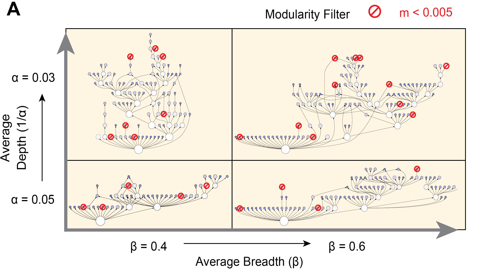

# CliXO (Clique eXtracted Ontology) 1.0 beta

## About

CliXO-1.0 is an updated version of the CliXO (Clique eXtracted Ontology) algorithm, originally described in the following paper:

M. Kramer et al. [Inferring gene ontologies from pairwise similarity data](https://doi.org/10.1093/bioinformatics/btu282). *Bioinformatics*, 30: i34-i42. (2014)

The input of the program is a weighted similarity network of objects (in our cases, genes), and the output is a directed acyclic graph (DAG), in which the leaf nodes are genes, and non-leaf nodes are gene sets called "terms" (communities).  

 Term A is a descendent of another term B (i.e. in the DAG there is a path from A to B) if the gene set for A is a subset of the gene set for B. The whole DAG is called a "data-driven hierarchy" inferred from the input network.

The new version has a few key improvements over the original version (see below), increasing the accuracy and robustness inferred from pairwise similarity (weighted network) data.

We have used CliXO-1.0 in the following studies:

F. Zheng et al., [Interpretation of cancer mutations using a multiscale map of protein systems.](https://www.science.org/doi/10.1126/science.abf3067) *Science* 374, eabf3067 (2021). (Please consider cite this paper if you use CliXO-1.0)

Y. Qin et al., Mapping cell systems across scales by fusing protein images and interactions. *Nature*, Accepted (2021).

A. Kratz et al., A multiscale map of protein assemblies in the DNA damage response. Submitted. 

## Usage

`./clixo -i input_file -a alpha [-b beta] [-m modularity cutoff] [-s stop_score]`

The binary was compiled on Ubuntu and you may need to run `make` or `make -B all` if you are running on other platforms.

`-i`: input file (similarity scores); A TSV file with three columns. The first two columns should be two strings for the node names (using numbers may cause problem); and the third column should be a value for the edge weight (from 0 to 1).

`-a`: **alpha**; for the step size of hierarchy construction; usually, a smaller value will create "deeper" hierarchies with more levels from leaves to the root.
   
`-b`: **beta**; for merging overlapping communities. Two existing communities will be merged if their similarity is above the threshold defined by this value. Usually a higher value will create a hierarchy with more smaller communities", which looks "broader".
  
`-m`: **modularity**; calculate the modularity of each community (adapted and modified from Newman-Girvan's modularity) in the network at the current score threshold; communities lower than this threshold will be removed from the output. Increasing the value will reduce the number of communities.
  
`-s`: A cutoff of similarity score, if set, the program will terminate when it reaches this point, and stop looking for more terms from scores lower than this threshold.

The effects of parameters are qualitatively illustrated in the following figure.

  

## Pseudocode

[PDF](CliXO%201.0%20pseudocode.pdf)

## Differences to the CliXO 0.3

We have addressed several problems in CliXO 0.3. 

1. When we visualized the DAGs generated by CliXO 0.3, we always saw that biggest modules in the hierarchy forming a long nested chain. 
2. We found CliXO 0.3 is quite sensitive to small perturbation in input scores, sometimes the content of medium-to-big size terms are very different even between two input scores with >0.99 pearson correlation.
3. Sometimes in CliXO 0.3 we found communities for which most of the edges are missing, which do not look like valid communities during visualization.

We found the major cause of this problem is due to a "missing edge inference" step. The idea of CliXO is based on finding maximal cliques in the network. However, real-world networks are noisy, and there could a large number of maximal cliques that are highly overlapping with each other, and thus in CliXO 0.3, parameter `beta` was introduced to merge highly overlapping cliques by adding the missing edges. 
However, during this step, the missing edges were added to the network, altering the network seen by the next iteration. This operation leads to the arfifacts mentioned above because:

1. The network edge density was increased in every iteration when missing edges were inferred. Thus, a big and tight component could form within a few iterations. The iterations afterwards only incrementally added the genes that has not been covered by the big component. Thus, a "long-chain" structure was formed.
2. The missing edges that were inferred early on have strong impact on the results in the future iterations. Slight perturbations of edge weights that affect early iterations could be augmented in future iterations. Thus the results were sensitive to slight perturbations.
3. Because missing edges became "real" after being inferred, it is possible that in future iterations, these edges were clustered together to form cliques/communities. But they are false positives since their actual edge weights are low.

In the new version, the "long-chain" structure never appeared again, and two similar inputs now generate much more similar output hierarchies.

## Auxillary functions (identical to CliXO_0.3): 

`extractOnt FILE THRESHOLD MIN_TERM_SIZE OUTFILE`

This script will allow the user to "peek" at the results of an in process CliXO run. It takes as input a CliXO output file (FILE), a similarity threshold above which terms will be saved and below which terms will be ignored (THRESHOLD), a minimum term size to keep (MIN_TERM_SIZE) and the name of an output file to create (OUTFILE).

`ontologyTermStats`

This utility will allow users to look at the ontology created by clixo.  There are several different types of stats that it can generate, but the most useful are the options "size" and "genes".  Option "size" will return a two column file where column one is the term identifier and column two is the number of leaf nodes/genes annotated to that term (all annotations are propagated upwards in the ontology).  Option "genes" adds a third column which is a comma separated list of all the genes annotated to the term.

Old version of CliXO can be found at
https://github.com/mhk7/clixo_0.3

## Limitations

Since maximal clique enumeration is NP-complete, applying CliXO on a large number of objects is computational prohibitive. We recommend not to exceed 2000 genes if you expect to finish runnning in a few hours. For problems of larger size, please consider another project of us, [HiDeF](https://github.com/fanzheng10/HiDeF).

## Acknowledgements

The improvements mentioned above benefited a lot from HiView (hiview.ucsd.edu), a web-based platform for visualizing hierarchical models mainly developed by Keiichiro Ono.

The author also thanks Michael Ku Yu, Daniel Carlin and Anton Kratz for helpful discussion.
